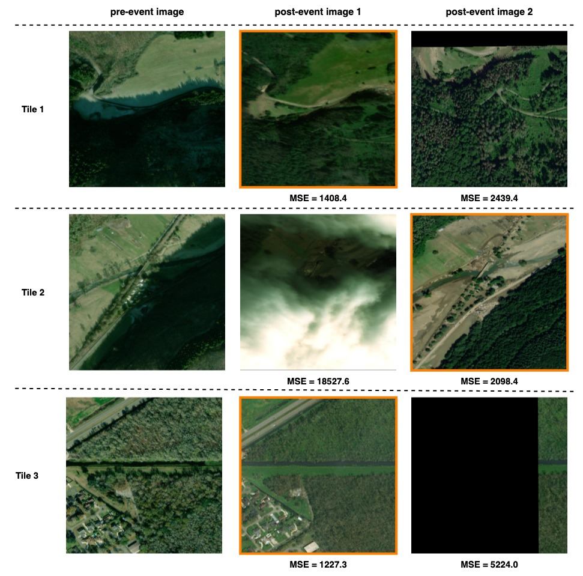
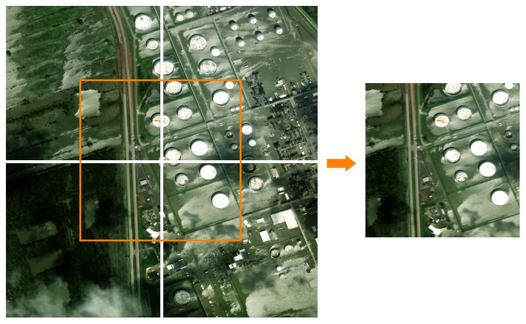
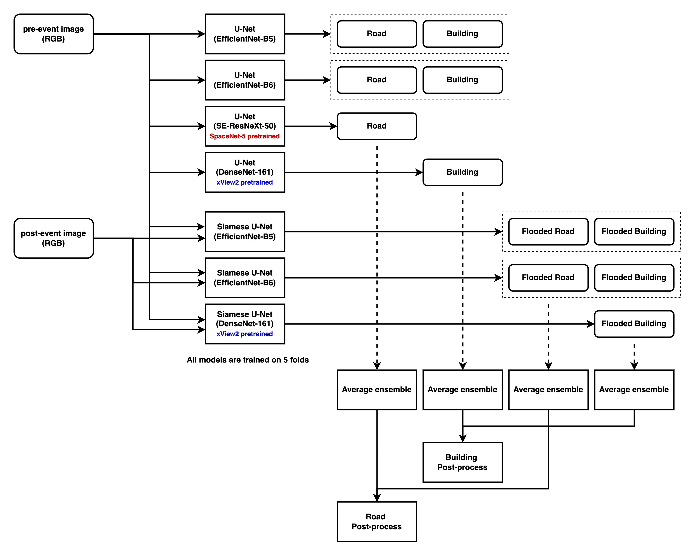

# motokimura's SpaceNet-8 Solution Description

## Overview

> Congrats on achieving a prize winning rank in the SpaceNet-8, Flood Detection Using Multiclass Segmentation challenge.
> As part of your final submission and in order to receive payment for this match, please complete the following document.

## 1. Introduction

> Tell us a bit about yourself, and why you have decided to participate in the contest.

- Name: Motoki Kimura
- Handle: motokimura
- Placement you achieved:
- About you: A computer vision research engineer working at a MaaS startup company in Tokyo. I often enjoy data science competitions related with remote sensing imageries and SpaceNet challenges are my most favorite.
- Why you participated in the challenge: SpaceNet-8 provides two challenging tasks for me: road network extraction and flood detection from pre- and post-event images. I thought I could learn a lot of new techniques (e.g., how to handle pre- and post-event images, how to extract road networks from segmentation results, etc.) through this challenge.

## 2. Solution Development

> How did you solve the problem? What approaches did you try and what choices did you make, and why? Also, what alternative approaches did you consider?

- I started by looking at all tiles in the dataset with the images and labels side by side. I noticed that some tiles had errors in the annotations. I decided to exclude these tiles from training and validation.
- At the same time, I noticed that in tiles which have 2 post-event images, there were cases where one of the post-event images was severely misaligned with the pre-event image, covered by clouds, or almost completely black. To discard such inappropriate post-event images, I calculated the MSE (mean squared error) between the pre-event image and each of the post-event images, and only used the post-event image with the smaller MSE.



- I also found that there were relatively few flood labels in the dataset and that in some tiles flood pixels are concentrated at the edges of the image. To increase the data, I generated new training samples by joining 4 adjacent tiles together. Note that such "mosaicing" was done only for the training set, and the inference was done independently for each tile in the test set.



- For algorithm development, given the relatively short competition period, I decided to follow the pipeline used in the baseline solution (building and road detection by U-Net, flood detection by Siamese U-Net, and post-processing) and focus on improving the models.
- When the dataset is relatively small, the random seed used in training can have a significant impact on the validation metric [as pointed out by SpaceNet-6 winner zbigniewwojna](https://github.com/SpaceNetChallenge/SpaceNet_SAR_Buildings_Solutions/blob/master/1-zbigniewwojna/README.md). I used a fixed seed for each fold so that I could compare the results more accurately.
- For both U-Net and Siamese U-Net models, I tried various backbone networks (e.g., EfficientNet, EfficientNetV2, RegNet, etc.) and found EfficientNet was the best. I experimented with EfficientNet-B3 to try various training configurations in a shorter period, and switched to EfficientNet-B5/B6 in the latter half of the competition.
- For the Siamese U-Net models used for the flood detection, the validation metric varied significantly from epoch to epoch. I found that applying EMA (exponential moving averaging) to the model weights and using larger (7x7) kernel in the penultimate convolution layer could mitigate the instability to some extent. I also tried tuning the lr schedule and different optimizers but they did not help.
- A week before the competition deadline, I noticed that finetuning SpaceNet-5 and xView2 winners' pretrained models significantly improved the score, so I added these pretrained models to the ensemble.
- To optimize the post-processing, I used the visualization tool provided by the competition organizer. I attempted to improve the baseline post-processing algorithm, but because it was already well tuned, only a few changes were made such as adjusting the detection thresholds.

## 3. Final Approach

> Please provide a bulleted description of your final approach. What
> ideas/decisions/features have been found to be the most important for your solution
> performance.



- Data Cleaning and Pre-processing
  - I excluded some tiles which contain annotation errors from training and validation. See `pre_image_blacklist` field in `configs/defaults/foundation.yaml` and `configs/defaults/flood.yaml` in my solution to know which tiles are removed.
  - For the tiles which have 2 post-event images, the MSE between the pre-event image and each of the post-event images was calculated, and only the post-event image with the smaller MSE was used. This was done to discard the inappropriate post-event images, such as those that were misaligned with the pre-event image, covered by clouds, or almost completely black.
  - To increase the data, I generated new training samples by joining 4 adjacent tiles in the same fold together. Note that such "mosaicing" was done only for the training set, and the inference was done independently for each tile in the test set.
- Validation
  - Done by 5-fold cross validation.
  - I found the training tiles could be divided into 4 geographically adjacent groups by using the pre-event image file name prefix (`105001001A0FFC00_0`, `10400100684A4B00_1`, `10300100AF395C00_2`, and `10500500C4DD7000_0`). I split each group into 5 segments by longitude and latitude, and combined 4 segments picked from each group into one fold. For more details, see `tools/make_folds_v3.py` in my solution.
- Models
  - Building and Road Segmentation
    - U-Net (EfficientNet-B5) x 5 folds & U-Net (EfficientNet-B6) x 5 folds
    - 5 output channels: building body, building border, building contact, road skelton, and road junction
      - 3-channel masks (building body, building border, and building contact) were often used in the previous SpaceNet challenges (e.g., in [cannab's 1st place solution for SpaceNet-4 challenge](https://github.com/SpaceNetChallenge/SpaceNet_Off_Nadir_Solutions/tree/master/cannab)), so I just followed it. Only the building body channel was used in the prediction phase.
      - The road junction (areas within 16-pixel radius from the road intersections) was used as an auxiliary target so that the models pay more attention to the intersections. I borrowed this idea from [cannab's 2nd place solution for SpaceNet-5 challenge](https://github.com/SpaceNetChallenge/SpaceNet_Optimized_Routing_Solutions/tree/master/cannab).
    - Loss: 1 * dice + 1 * bce
    - Random crop size: 448x448, batch size: 8, optimizer: Adam, base lr: 2e-4.
    - For EfficientNet-B5, trained 210 epochs decaying lr by 0.1 at epochs 120 and 180.
    - For EfficientNet-B6, trained 140 epochs decaying lr by 0.1 at epochs 80 and 120.
  - Flood Segmentation
    - Siamese U-Net (EfficientNet-B5) x 5 folds & Siamese U-Net (EfficientNet-B6) x 5 folds
      - Siamese U-Net inputs pre- and post-event images separately to U-Net, concatenates decoder outputs, and apply 7x7 convolution and 1x1 convolution.
      - U-Net in the siamese network was initialized with the corresponding building and road segmentation model. Finetuning from the pretrained weights enabled faster convergence and better accuracy.
    - 4 output channels: flooded building, non-flooded building, flooded road, and non-flooded road
    - Loss: 1 * dice + 1 * bce
    - Random crop size: 320x320, batch size: 8, optimizer: Adam, lr: 1e-4.
    - Trained 80 epochs with the constant lr.
    - EMA (momentum: 2e-3, interval: 1 epoch) was applied to the model weights to mitigate training instability.
  - Road Segmentation with SpaceNet-5 pretrained models
    - U-Net (SE-ResNeXt-50) x 5 folds
      - [SpaceNet-5 winner XD_XD's U-Net models](https://github.com/SpaceNetChallenge/SpaceNet_Optimized_Routing_Solutions/tree/master/xd_xd) were finetuned on SpaceNet-8 road labels.
      - Since SpaceNet-5 dataset covers more diverse cities, finetuning from the XD_XD's pretrained weights improved the road segmentation results significantly (+0.89 in the public LB).
    - 1 output channel: road skelton
    - Loss: 1 * dice + 1 * bce
    - Random crop size: 512x512, batch size: 10, optimizer: Adam, lr: 1e-5.
    - Trained 120 epochs decaying lr by 0.1 at epoch 80.
  - Building Segmentation with xView2 pretrained models
    - U-Net (DenseNet-161) x 5 folds
      - [xView2 2nd place selim_sef's U-Net models](https://github.com/DIUx-xView/xView2_second_place) were finetuned on SpaceNet-8 building labels.
      - Finetuning from the selim_sef's pretrained weights improved the building segmentation results moderately (+0.32 in the public LB).
    - 1 output channel: building body
    - Loss: 1 * dice + 1 * bce
    - Random crop size: 512x512, batch size: 10, optimizer: Adam, lr: 1e-5.
    - Trained 120 epochs decaying lr by 0.1 at epoch 80.
  - Flooded Building Segmentation with xView2 pretrained models
    - Siamese U-Net (DenseNet-161) x 5 folds
      - [xView2 2nd place selim_sef's Siamese U-Net models](https://github.com/DIUx-xView/xView2_second_place) were finetuned on SpaceNet-8 flood labels.
      - Finetuning from the selim_sef's pretrained weights improved the flood segmentation results moderately (+0.56 in the public LB).
    - 2 output channels: flooded building and non-flooded building
    - Loss: 1 * dice + 1 * bce
    - Random crop size: 352x352, batch size: 10, optimizer: Adam, lr: 1e-5.
    - Trained 80 epochs with the constant lr.
    - EMA (momentum: 2e-3, interval: 1 epoch) was applied to the model weights to mitigate training instability.
- Post-processing
    - Post-processing is the same as the baseline except for the following:
      - Thresholds for the model outputs were adjusted.
        - Building: score_thresh=0.5, flood_score_thresh=0.6, flood_area_thresh=0.5
        - Road: score_thresh=0.3, flood_score_thresh=0.3, flood_area_thresh=0.3
      - Dilation with a 5x5 kernel was applied to the flooded road mask to cope with small misalignments between the road skelton and the flooded road mask.
- Others
  - Average ensemble was performed to combine the outputs from different models.
    - Building: 0.25 * `U-Net (EfficientNet-B5)` + 0.25 * `U-Net (EfficientNet-B6)` + 0.5 * `U-Net (DenseNet-161)`
    - Road: 0.25 * `U-Net (EfficientNet-B5)` + 0.25 * `U-Net (EfficientNet-B6)` + 0.5 * `U-Net (SE-ResNeXt-50)`
    - Flooded Building: 0.25 * `Siamese U-Net (EfficientNet-B5)` + 0.25 * `Siamese U-Net (EfficientNet-B6)` + 0.5 * `Siamese U-Net (DenseNet-161)`
    - Flooded Road: 0.5 * `Siamese U-Net (EfficientNet-B5)` + 0.5 * `Siamese U-Net (EfficientNet-B6)`
  - As for TTA, only the left-right flipping TTA was applied to the flooded building channel.
  - I trained all the models above with fp16. This reduces the GPU memory usage by 30% compared to fp32 training.
  - No external data was used.

## 4. Open Source Resources, Frameworks and Libraries

> Please specify the name of the open source resource, the URL to where it can be found, and it’s license type:

Please see `licenses/README.md` in my solution.

## 5. Potential Algorithm Improvements

> Please specify any potential improvements that can be made to the algorithm:

- I noticed pre- and post-event images have small misalignments in some tiles, and this could have caused the training instability of the flood detection models. The images could be aligned more precisely with image feature matching networks, such as SuperGlue and LoFTR.
- Since the evaluation metric is sensitive to false positives in non-flooded tiles, post-processing to eliminate false positives, e.g., removing flooded roads below a certain length, would be effective.
- Richer data augmentation. I only used random cropping during training.

## 6. Algorithm Limitations

> Please specify any potential limitations with the algorithm:

- On unpaved roads covered with muddy water, the algorithm often fails to detect flooding. This may be due to the similar appearance of these roads before and after the event.
- The algorithm sometimes makes false positives when there are large differences in appearance between pre- and post-event images (due to differences in viewing angles, light conditions, and seasonal vegetation changes).
- As I used 35 models in total, training and inference take time.

## 7. Deployment Guide

> Please provide the exact steps required to build and deploy the code:

The solution follows [Topcoder's marathon-docker-template](https://github.com/topcoderinc/marathon-docker-template/tree/master/data-plus-code-style),
and is assumed to be run on a p3.8xlarge Linux AWS instance.

Setup the instance and download SpaceNet-8 dataset by following `docs/ec2_setup.md`.

Then, run following:

```
nvidia-docker build -t motokimura .
nvidia-docker run --ipc=host -v <local_data_path>:/data:ro -v <local_writable_area_path>:/wdata -it motokimura
```

## 8. Final Verification

> Please provide instructions that explain how to train the algorithm and have it execute
> against sample data:

Again, the solution is assumed to be run on a p3.8xlarge Linux AWS instance.

Run following in the container:

```
./train.sh /data/train/
./test.sh /data/test/ ./output.csv
```

## 9. Feedback

> Please provide feedback on the following - what worked, and what could have been
> done better or differently?

- Problem Statement
  - It was well described and easy to understand for me.
- Data
  - Thank you for making this awesome dataset public! I can imagine how hard it was to prepare this dataset.
  - It would be even better if the annotation errors could be reduced and more AOIs are included.
- Contest
  - The baseline algorithm was easy to understand and I found it a good starting point.
  - The visualization tool was really helpful for the validation.
- Scoring
  - It may be possible to change the evaluation metric to be more recall oriented (I feel the current metric is too sensitive to false positives in non-flooded areas, thus is more precision oriented). In real-world applications, e.g., route finding after a flood, it is crucial not to include flooded roads in the route.
